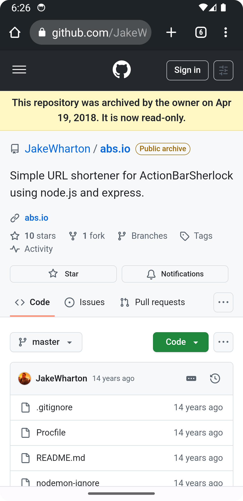

# GitHub Explorer App

A simple yet powerful Android app built with **Jetpack Compose**, **Hilt**, and **MVVM**, allowing users to search for GitHub profiles and view their public repositories.

<p align="center">
  
</p>

## Features

- 🔍 **Search GitHub Users** by username.
- 👤 View **user profile details** (name, bio, followers, following).
- 📦 Browse **public repositories**, filter out forked ones.
- 🌐 Tap on a repository to open its GitHub page.
- 📴 Displays proper UI states for **loading, error**, and **no internet**.
- ✅ Comprehensive **unit & UI tests** with Turbine, MockK, and Jetpack Compose Test.
  
## Tech Stack

- 💡 Kotlin
- 🧱 Jetpack Compose
- 🔁 Flow + StateFlow
- 🔍 Retrofit + Coroutines
- 🧪 Unit Testing: `kotlinx.coroutines.test`, `app.cash.turbine`
- 🧪 UI Testing: Jetpack Compose Testing APIs
- 🧰 DI: Hilt

## Screenshots

| Search User | Repo List | Repo details |
|-------------|--------------|-----------|
|  |  |  |

## Getting Started

1. Clone the repo:

   ```bash
   git clone https://github.com/your-username/Github-App.git
